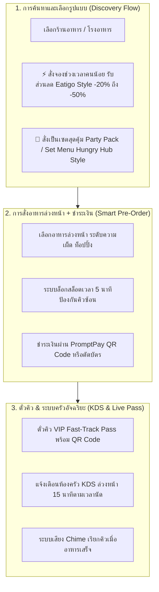

# 🍽️ การวิเคราะห์สถาปัตยกรรมระบบจองร้านอาหารและดีลชั้นนำ (Hungry Hub vs Eatigo vs Chope Benchmark)

> **ถอดรหัสฟีเจอร์ระดับท็อปเพื่อยกระดับ QueueUp ให้เป็นระบบจองคิว + สั่งอาหารล่วงหน้า + ดีลส่วนลดช่วงเวลาที่สมบูรณ์แบบที่สุด**

---

## 📊 1. ตารางเปรียบเทียบจุดเด่นของแต่ละแพลตฟอร์ม

| มิติการเปรียบเทียบ | 🍗 **Hungry Hub** | ⏰ **Eatigo** | 🍷 **Chope (Grab Dine Out)** |
| :--- | :--- | :--- | :--- |
| **จุดขายหลัก (Value Proposition)** | **แพ็กเกจเซตสุดคุ้ม & บุฟเฟต์ All-You-Can-Eat (AYCE)** คุมงบได้ ไม่มีบิลช็อก | **ส่วนลดตามช่วงเวลา (Time-Based Yield Discounts 10% - 50%)** กระจายลูกค้าช่วงคนน้อย | **จองโต๊ะร้านดัง & บัตรกำนัลส่วนลด (Vouchers)** การันตีที่นั่ง สะสมคะแนน |
| **รูปแบบการจอง** | เลือกแพ็กเกจ (Party Pack / Buffet) ➜ จองเวลา ➜ **จ่ายเงิน/มัดจำล่วงหน้า 100%** | เลือกวัน ➜ **เลือกปุ่มเวลาที่มี % ส่วนลด (-50%, -30%)** ➜ ไปกินที่ร้านได้เลย | เลือกร้าน ➜ ระบุจำนวนคนและเวลา ➜ รับตั๋วยืนยัน ➜ สะสม Chope-Dollars |
| **สิ่งที่ร้านค้าได้ประโยชน์** | ยอดใช้จ่ายต่อหัวสูงขึ้น (Higher Ticket Size) ลูกค้าสั่งเป็นชุดใหญ่ | เติมเต็มที่นั่งว่างในช่วงเวลาเงียบ (Off-Peak เช่น 14:00 - 16:30 น.) | ลดปัญหา No-Show (จองแล้วไม่มา) และจัดการรอบหมุนเวียนโต๊ะในร้าน |

---

## 💡 2. สุดยอดฟังก์ชันที่เราจะดึงมาใส่ใน QueueUp (The Ultimate Hybrid Model)

---

### 🔥 3 ฟีเจอร์ทรงพลังสำหรับ QueueUp:

#### 1. ส่วนลดตามช่วงเวลาแบบ Eatigo (Off-Peak Yield Discounts)
* **วิธีทำงาน:**
  * ช่วงเวลาพีก (11:45 - 12:45 น.): ราคาปกติ (คิวเยอะ)
  * ช่วงเวลา Early-Bird (11:00 - 11:30 น.): **ลดทันที 20% - 30%**
  * ช่วงเวลา Late-Lunch (13:30 - 14:30 น.): **ลดสูงสุด 40% - 50%**
* **ผลลัพธ์:** ช่วยกระจายคิวนักเรียน/ลูกค้าไม่ให้มาแออัดพร้อมกันตอนเที่ยงตรง และร้านค้าขายได้ตลอดทั้งวัน

#### 2. เซตเมนูสุดคุ้มแบบ Hungry Hub (Party Set & Value Combo)
* **วิธีทำงาน:**
  * ร้านค้าสามารถจัดเซต Combo ได้ เช่น:
    * *เซตประหยัดเดี่ยว:* ข้าวกะเพรา + ไข่ดาว + น้ำสมุนไพร (฿69 จาก ฿85)
    * *เซตคู่หูเพื่อนซี้ (Party Pack for 2):* กับข้าว 3 อย่าง + ข้าว 2 จาน + ชานม 2 แก้ว (฿159 จาก ฿200)
* **ผลลัพธ์:** ลูกค้าสั่งง่ายใน 1 คลิก ไม่ต้องเลือกทีละเมนู และร้านค้าได้ยอดออเดอร์ก้อนใหญ่

#### 3. ตั๋วคิวดิจิทัล VIP & QR Code แบบ Chope
* **วิธีทำงาน:**
  * ลูกค้าที่สั่งอาหารและชำระเงินล่วงหน้า จะได้ตั๋ว **Fast-Track VIP Ticket**
  * เมื่อเดินมาถึงหน้าร้านตอนถึงเวลา ยื่นสแกน QR Code แล้วรับถุงอาหารร้อนๆ ไปได้ทันที ไม่ต้องต่อคิวกับคนที่เพิ่งมาสั่งหน้าร้าน
