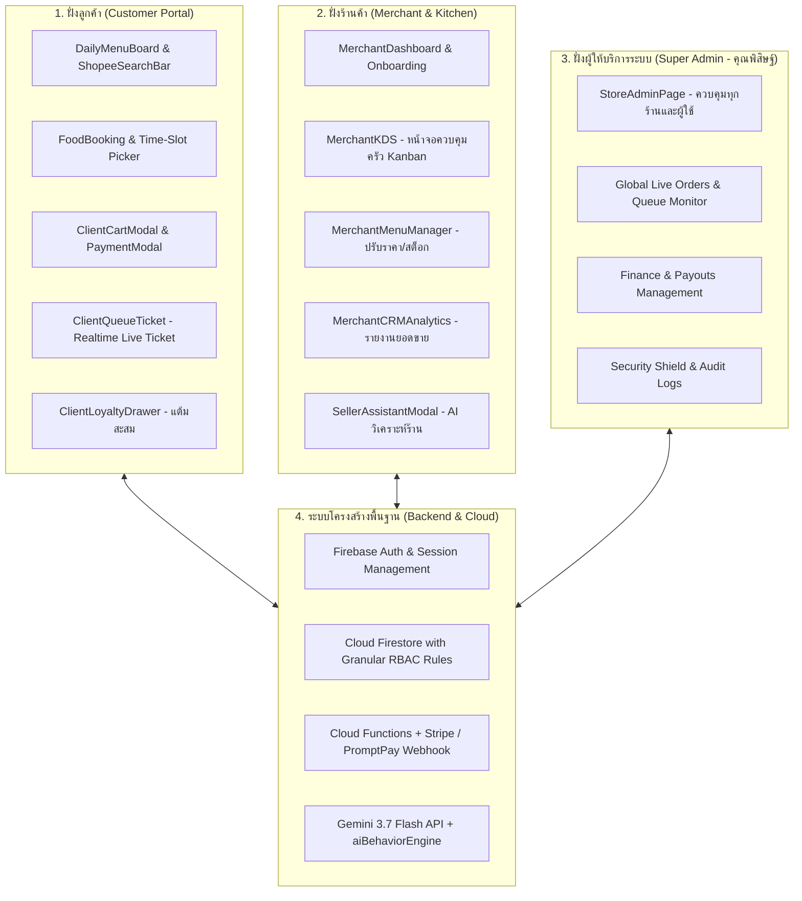

# 🚀 QueueUp — แผนการพัฒนาระบบหลักฉบับสมบูรณ์ (Master Development Plan)

> **เอกสารพิมพ์เขียวรวมสถาปัตยกรรม 3 ฝั่ง (Customer, Merchant KDS, Super Admin) และระบบ AI**

---

## 🎯 1. สถาปัตยกรรมระบบรวม (Unified Architecture)

---

## 📋 2. ฟังก์ชันเด่นที่คัดเลือกและรวมเข้าสู่ Codebase เรียบร้อยแล้ว

| หมวดหมู่ | คอมโพเนนต์หลัก | หน้าที่สำคัญ |
| :--- | :--- | :--- |
| **Kitchen KDS** | `src/components/MerchantKDS.tsx` | หน้าจอครัว Kanban แบ่งคิวตามสี (เขียว/ส้ม/แดง) พร้อมปุ่ม Bump 1-Tap |
| **Menu Manager** | `src/components/MerchantMenuManager.tsx` | จัดการสต็อกอาหาร, สวิตช์ปิดเมนูหมด, ปรับราคาอาหารแบบ Real-time |
| **Merchant AI** | `src/components/SellerAssistantModal.jsx` | ผู้ช่วย AI ให้คำแนะนำการตั้งราคาและเมนูขายดี |
| **Super Admin** | `src/pages/StoreAdminPage.tsx` | แผงควบคุม God Mode สำหรับคุณพิสิษฐ์ จัดการทุกร้านค้าและผู้ใช้ |
| **Virtual Ticket** | `src/components/ClientQueueTicket.jsx` | ตั๋วคิวดิจิทัลแสดงสถานะ 4 ขั้นตอน พร้อม QR Code |
| **Time-Slot Picker** | `src/pages/FoodBooking.tsx` | ระบบเลือกเวลารับอาหารล่วงหน้า ป้องกันคิวชนกัน |
| **Payments** | `src/components/PaymentModal.jsx` & `functions/` | ระบบชำระเงิน PromptPay QR Code และ Stripe Webhooks |
| **Security Shield** | `src/services/aiSecurityShield.js` & `firestore.rules` | ป้องกันการโจมตีและการเข้าถึงข้อมูลข้ามร้านค้า (Store Isolation) |

---

## 🗓️ 3. แผนการลงมือพัฒนาสำหรับวันพรุ่งนี้ (Tomorrow Action Items)

### ช่วงที่ 1: การปรับแต่ง UX/UI & Mobile Responsiveness
1. ปรับหน้า `DailyMenuBoard.jsx` และ `FoodBooking.tsx` ให้เป็นสไตล์ **Modern Dark Slate Glass** ตามคู่มือ `UI_UX_DESIGN_SYSTEM_GUIDE.md`
2. เชื่อมโยง `ClientQueueTicket.jsx` เข้ากับระบบแจ้งเตือนเสียง (Audio Chime) เมื่อแม่ค้ากดเรียกคิว

### ช่วงที่ 2: ระบบ Kitchen Display System (KDS) & Real-time Sync
1. ตรวจสอบการอัปเดตสถานะแบบ Real-time ใน `MerchantKDS.tsx` เมื่อลูกค้าสั่งอาหาร
2. เชื่อมต่อ Firestore Snapshot Listener เพื่อให้ข้อมูลสองฝั่งเปลี่ยนสถานะพร้อมกันทันที

### ช่วงที่ 3: ระบบ Super Admin (Platform Owner Portal)
1. เปิดหน้า `StoreAdminPage.tsx` และตั้งค่าสิทธิ์ให้บัญชีของคุณเป็น **Super Admin**
2. ทดสอบระบบสั่งระงับร้านค้า, แก้ไขข้อมูลร้าน และดูรายงานยอดขายรวมทั้งโรงอาหาร
