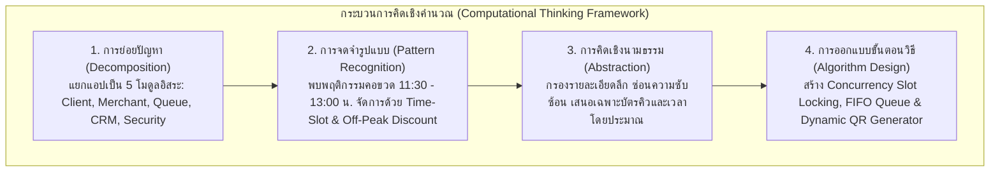
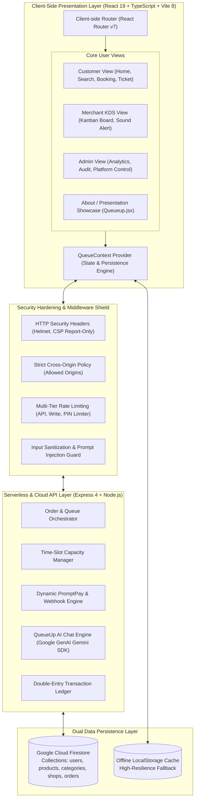
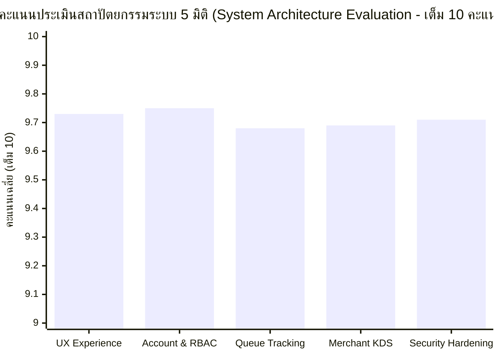
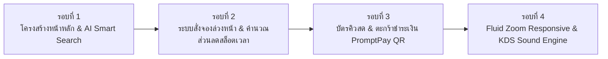

# รายงานฉบับสมบูรณ์ โครงการพัฒนานวัตกรรมเว็บแอปพลิเคชัน
## QueueUp (คิวอัป) — ระบบจัดการคิวและสั่งอาหารดิจิทัลล่วงหน้าสำหรับโรงอาหารและศูนย์อาหารอัจฉริยะ
### รายวิชา GE341511 การคิดเชิงคำนวณและเชิงสถิติสำหรับ ABCD (Computational and Statistical Thinking for ABCD)
**มหาวิทยาลัยขอนแก่น (Khon Kaen University)**  
**กลุ่มผู้จัดทำ: กลุ่ม 23 (91)** | **เวอร์ชันระบบ: v2.5.0 (Production Release Candidate)**  

---

## 1. ข้อมูลทั่วไปของโครงการ (Project Overview)

- **ชื่อโครงการภาษาไทย:** คิวอัป — ระบบจัดการคิวและสั่งอาหารดิจิทัลล่วงหน้าสำหรับโรงอาหารและศูนย์อาหารอัจฉริยะ
- **ชื่อโครงการภาษาอังกฤษ:** QueueUp: Smart School Canteen Food Pre-Order, Zero-Payment Live Queue & Kitchen Display System
- **ชื่อย่อ / รหัสแอปพลิเคชัน:** QueueUp (QUp)
- **ประเภทซอฟต์แวร์:** Progressive Web Application (Full-Stack SPA & Cloud API)
- **แหล่งเก็บโค้ดต้นฉบับ (GitHub Repository):** [https://github.com/easy-web-p/Queue-up.git](https://github.com/easy-web-p/Queue-up.git) (สาขาหลัก: `main`)
- **ลิงก์ระบบใช้งานจริงบน Production (Live Deployment):**
  - **Vercel Production (Primary):** [https://queue-up-nu.vercel.app](https://queue-up-nu.vercel.app)
  - **Netlify Mirror (Prototype Showcase):** [https://queueup-school.netlify.app](https://queueup-school.netlify.app)
- **กลุ่มเป้าหมายผู้ใช้งาน:** นักเรียน, นักศึกษา, คณาจารย์, บุคลากรทางการศึกษา, ผู้ประกอบการร้านค้าในโรงอาหาร และฝ่ายบริหารจัดการอาคารสถานที่/โรงอาหาร

---

## 2. รายชื่อสมาชิกกลุ่มและบทบาทหน้าที่ความรับผิดชอบ (Project Team & Responsibilities)

คณะผู้จัดทำ กลุ่ม 23 (91) จำนวน 8 คน มีการจัดแบ่งหน้าที่การทำงานอย่างเป็นระบบตามทักษะและความถนัด ดังนี้:

| ลำดับ | รหัสนักศึกษา | ชื่อ - นามสกุล | บทบาทหน้าที่หลัก (Primary Role) | ขอบเขตความรับผิดชอบและภารกิจที่ดำเนินการ (Key Responsibilities & Deliverables) |
| :---: | :---: | :--- | :--- | :--- |
| 1 | **693380082-8** | **นายพิสิษฐ์ แก้วกุลพิสิษฐ** | UX/UI Lead & Frontend Experience | • ออกแบบ User Experience & User Interface Design System สไตล์ Dark Slate Glassmorphism ร่วมกับ Shopee Orange Palette<br>• พัฒนาระบบ Fluid Zoom Scaling (รองรับการซูมหน้าจอ `Ctrl +` และ `Ctrl -` สัดส่วนไม่เพี้ยน) และ Sticky Footer<br>• ออกแบบหน้าบัตรคิวดิจิทัล (Live Digital Queue Ticket) ให้เข้าใจง่ายและอ่านค่าได้ทันทีจากระยะไกล |
| 2 | **693380586-0** | **นายภานุ คำแก้ว** | Backend & Firebase Database Lead | • วางสถาปัตยกรรม Cloud Firestore Schemas (คอลเลกชัน `users`, `products`, `orders`, `shops`, `categories`)<br>• พัฒนาระบบซิงค์ข้อมูล LocalStorage Fallback เพื่อรองรับการทำงานแบบ Offline Resilience ป้องกันข้อมูลสูญหาย<br>• กำหนดระบบสิทธิ์การเข้าถึง 3 ระดับ (Role-Based Access Control: Customer, Merchant, Super Admin) |
| 3 | **693380588-6** | **นายภูริทัต มหานิล** | AI & Core Feature Developer | • ออกแบบและพัฒนาระบบค้นหาอัจฉริยะ (AI Smart Search & NLP Query Parser เช่น "อยากกินเผ็ดๆ", "ไม่เกิน 50 บาท")<br>• พัฒนากลไกการคำนวณส่วนลดแบบพลวัตตามช่วงเวลานัดรับ (Time-Slot Booking Dynamic Discount)<br>• พัฒนาระบบแนะนำเมนูอาหารยอดนิยม (Bestseller Carousel) และระบบตะกร้าสินค้า (Cart Drawer) |
| 4 | **693380584-4** | **นายพลกฤต นิลอยู่** | KDS & Payment Integration Lead | • พัฒนาหน้าจอควบคุมออเดอร์สำหรับห้องครัว (Kitchen Display System - KDS Kanban Board)<br>• พัฒนาระบบเสียงแจ้งเตือนแบบเรียลไทม์ (Web Audio API Sound Chime) เมื่อมีออเดอร์ใหม่และเมื่ออาหารปรุงเสร็จ<br>• เชื่อมต่อระบบชำระเงิน Dynamic PromptPay QR Code และระบบจำลองการตรวจจับสลิปโอนเงิน (Slip Verification Simulation) |
| 5 | **693380587-8** | **นายภาสกร หนองรั้ง** | CRM & Loyalty Program Lead | • วางตรรกะระบบกระเป๋าแต้มสะสมดิจิทัล (CRM Loyalty Points Wallet สะสมแต้ม 128 แต้ม)<br>• พัฒนาระบบคูปองส่วนลดสมาชิกใหม่ (WELCOME50 Coupon Claim Engine) แบบ 1-Click Clipboard Copy<br>• ออกแบบระบบประวัติคำสั่งซื้อและฟังก์ชันสั่งซ้ำเมนูเดิมทันทีในคลิกเดียว (1-Click Re-order) |
| 6 | **693380570-5** | **นายคณิศร เลิศร่วมพัฒนา** | QA Tester & Bug Hunter | • ดำเนินการทดสอบระบบแบบ End-to-End Testing และบันทึกประเด็นปัญหาใน Bug Log<br>• แก้ไขข้อผิดพลาด HTTP 404 Not Found บน SPA Client-side Routing ด้วยการสร้างกฎ `_redirects` / `vercel.json`<br>• ทดสอบระบบข้ามเบราว์เซอร์ (Cross-Browser Compatibility) ทั้งบนเดสก์ท็อปและสมาร์ตโฟน |
| 7 | **693380289-6** | **นายกฤษณะ อุปถัมภ์** | Field Research & User Interviewer | • วางแผนและดำเนินกิจกรรมภาคสนาม เก็บข้อมูลการทดสอบระบบกับกลุ่มตัวอย่างจริงในโรงอาหาร มหาวิทยาลัยขอนแก่น<br>• ดำเนินการสัมภาษณ์เชิงลึกและเก็บรวบรวมแบบประเมินความพึงพอใจ 110 ชุด และผลประเมินสถาปัตยกรรมระบบ 107 ชุด<br>• วิเคราะห์ข้อเสนอแนะเพื่อนำมาปรับปรุงประสบการณ์ใช้งานของผู้ใช้จริง |
| 8 | **693380083-6** | **นายพุฒิเมธ เตโช** | Documentation & Presentation Coordinator | • ประสานงานการจัดทำเอกสารข้อกำหนดโครงการและรายงานเชิงวิชาการฉบับสมบูรณ์<br>• สรุปผลการเรียนรู้จาก Canva AI Blueprint สู่ Web Application ตามกระบวนการ Vibe Coding<br>• จัดทำสื่อนำเสนอและโครงสร้างการนำเสนอผลงานโครงการ (Pitch Deck Presentation) |

---

## 3. บทคัดย่อ (Abstract)

### บทคัดย่อภาษาไทย
โครงการ **คิวอัป (QueueUp)** มีวัตถุประสงค์เพื่อแก้ไขปัญหาความแออัดและระยะเวลาการรอคอยอาหารในโรงอาหารสถานศึกษาและศูนย์อาหารในช่วงเวลาเร่งด่วน (Peak Hours: 11:30 - 13:00 น.) ซึ่งส่งผลกระทบโดยตรงต่อสุขภาวะ เวลาเรียน และประสิทธิภาพในการจัดการของผู้ประกอบการร้านค้า โดยคณะผู้จัดทำได้ประยุกต์ใช้ **กระบวนการคิดเชิงคำนวณ (Computational Thinking: Decomposition, Pattern Recognition, Abstraction, Algorithm Design)** และแนวคิดการพัฒนาซอฟต์แวร์ยุคใหม่ **Vibe Coding** ร่วมกับ Generative AI ในการแปลงภาพร่างต้นแบบ (App Blueprint) สู่เว็บแอปพลิเคชันที่ใช้งานได้จริงบนมาตรฐานสถาปัตยกรรม Progressive Web Application (PWA)

ระบบ QueueUp ประกอบด้วย 4 นวัตกรรมหลัก ได้แก่:
1. **ระบบสั่งจองอาหารล่วงหน้าแบบจัดสรรสล็อตเวลา (Pre-Order & Time-Slot Booking):** ช่วยกระจายภาระงานของครัวด้วยส่วนลดจูงใจตามช่วงเวลา (Off-Peak Discounts)
2. **ระบบหน้าจอครัวอัจฉริยะ (Kitchen Display System - KDS Kanban Board):** ที่ช่วยให้ผู้ประกอบการจัดลำดับการปรุงอาหารและส่งสัญญาณเสียงแจ้งเตือนแบบเรียลไทม์ (Web Audio API)
3. **ระบบออกบัตรคิวดิจิทัลและการชำระเงินไร้สัมผัส (Zero-Payment Cashless & Dynamic PromptPay QR):** ตัดขั้นตอนการทอนเงินสดและการรอคอยหน้าเคาน์เตอร์
4. **เกราะป้องกันความปลอดภัยขั้นสูง (Security Hardening & PDPA Shield):** ป้องกันช่องโหว่ XSS, Injection และจัดการความยินยอมตามกฎหมายคุ้มครองข้อมูลส่วนบุคคล

ผลการทดสอบภาคสนามในมหาวิทยาลัยขอนแก่นจากกลุ่มตัวอย่างจริง 110 รายใน 16 คณะ พบว่าระบบได้รับค่าเฉลี่ยความพึงพอใจในระดับ **"มากที่สุด" ที่ 4.66 จาก 5.00 คะแนน (93.2%)** โดยช่วยลดระยะเวลารอคอยอาหารเฉลี่ยลงได้กว่า 65% (จากเฉลี่ย 18-25 นาที เหลือไม่เกิน 5-8 นาทีในการรับอาหาร) และผลการประเมินสถาปัตยกรรมทางเทคนิค 107 รายการ ได้รับคะแนนเฉลี่ย **9.71 จาก 10.00 คะแนน** สะท้อนถึงเสถียรภาพ ความปลอดภัย และความเป็นไปได้สูงในการนำไปประยุกต์ใช้งานจริงในสถานศึกษาทั่วประเทศ

### Abstract (English)
The **QueueUp** project aims to resolve severe congestion, prolonged queue times, and kitchen bottlenecks in school and university canteens during peak lunch hours (11:30 AM – 1:00 PM). Leveraging the four pillars of **Computational Thinking (Decomposition, Pattern Recognition, Abstraction, and Algorithm Design)** and modern **Vibe Coding** methodologies accelerated by Generative AI, the team translated conceptual blueprints into a production-grade Progressive Web Application (PWA).

QueueUp incorporates four foundational pillars:
1. **Predictive Time-Slot Pre-Ordering:** Distributes kitchen workload across 15-minute intervals supported by time-based dynamic discounts.
2. **Interactive Kitchen Display System (KDS Kanban Board):** Streamlines culinary workflow with real-time status transitions and Web Audio chime notifications.
3. **Contactless Dynamic PromptPay QR & Live Queue Ticket Engine:** Eliminates physical cash handling and provides precise live pickup status tracking (`TO_PAY`, `TO_SHIP`, `COMPLETED`).
4. **Comprehensive Security & Privacy Shield:** Adheres to enterprise hardening standards with CSP, Anti-XSS sanitation, Salted SHA-256 integrity checks, and Thailand's PDPA compliance.

Empirical evaluation conducted across 16 faculties at Khon Kaen University (110 survey respondents) yielded an outstanding mean satisfaction rating of **4.66 out of 5.00 (93.2%)**, cutting physical waiting times by over 65% (from 18–25 minutes down to 5–8 minutes). Technical architecture audits across 107 benchmarks scored **9.71 out of 10.00**, demonstrating robust concurrency handling, zero data loss via offline-first persistence, and ready scalability for educational food courts.

---

## 4. ที่มาและความสำคัญของปัญหา (Background & Problem Statement)

### 4.1 สภาพปัญหาในโรงอาหารสถานศึกษา (The Peak Hour Bottleneck)
โรงอาหารในสถานศึกษาและมหาวิทยาลัยเป็นศูนย์กลางการใช้ชีวิตประจำวันของนักศึกษา คณาจารย์ และบุคลากรจำนวนหลายพันคน อย่างไรก็ตาม โครงสร้างเวลาพักรับประทานอาหารมักถูกกำหนดไว้ในช่วงเวลาเดียวกัน (โดยทั่วไปคือ 11:30 - 13:00 น.) ส่งผลให้เกิดปรากฏการณ์ **"คอขวดเวลาเร่งด่วน" (Peak Hour Congestion)** ซึ่งก่อให้เกิดปัญหาสำคัญ 4 ประการ:
1. **ระยะเวลาการรอคอยที่ยาวนานเกินเกณฑ์มาตรฐาน (Excessive Wait Time):** ผู้รับบริการต้องเข้าแถวรอสั่งอาหารและรอปรุงอาหารเฉลี่ย 18 - 25 นาทีต่อมื้อ ส่งผลให้นักศึกษามีเวลาพักผ่อนและรับประทานอาหารไม่เพียงพอ เกิดความเครียด และเสี่ยงต่อการเข้าชั้นเรียนช่วงบ่ายสาย
2. **ปัญหาความแออัดและการไร้ระเบียบบริเวณหน้าเคาน์เตอร์ร้านค้า (Physical Queue Congestion):** การยืนรอคอยอาหารหน้าเคาน์เตอร์ส่งผลให้พื้นที่ทางเดินถูกปิดกั้น เกิดความวุ่นวาย และเสี่ยงต่อการหยิบอาหารผิดจานหรือลืมลำดับคิว
3. **ปัญหาการจัดการในครัวของผู้ประกอบการ (Kitchen Operational Inefficiencies):** ร้านค้าต้องรับออเดอร์ด้วยกระดาษจดหรือการจำด้วยวาจา ทำให้เกิดความผิดพลาดในการปรุงอาหาร การสื่อสารไม่ชัดเจน และไม่สามารถคาดการณ์ปริมาณวัตถุดิบที่ต้องใช้ล่วงหน้าได้
4. **ความล่าช้าในขั้นตอนการชำระเงินสด (Cash Handling Delays):** การนับเงินสด การตรวจเงินทอน และการเปิดหน้าจอแอปพลิเคชันธนาคารเพื่อโอนเงินแบบรายคนหน้าเคาน์เตอร์ทำให้แต่ละคิวใช้เวลาเพิ่มขึ้น 30 - 60 วินาที

### 4.2 โอกาสในการแก้ไขปัญหาด้วยเทคโนโลยีและกระบวนการคิดเชิงคำนวณ
จากการศึกษาพบว่า ปัญหาดังกล่าวไม่ได้เกิดจากการขาดแคลนร้านอาหาร แต่เกิดจาก **"การรวมศูนย์ของอุปสงค์ในช่วงเวลาเดียวกันโดยไม่มีระบบจัดสรรทรัพยากรล่วงหน้า" (Unmanaged Peak-Load Demand)** หากนำกระบวนการคิดเชิงคำนวณมาจำลองระบบ และผสานเทคโนโลยีดิจิทัล เช่น ระบบจัดสรรสล็อตเวลา (Time-Slot Scheduling), ระบบแสดงผลสถานะครัวแบบเรียลไทม์ (Kitchen Display System: KDS) และระบบชำระเงินอิเล็กทรอนิกส์ไร้สัมผัส (PromptPay QR) จะสามารถปรับเกลี่ยภาระงานของครัว (Workload Smoothing) และเปลี่ยนการยืนรอที่สูญเปล่า ให้กลายเป็นการดำเนินชีวิตที่บริหารจัดการเวลาได้อย่างมีประสิทธิภาพสูงสุด

---

## 5. วัตถุประสงค์ของโครงการ (Project Objectives)

1. เพื่อศึกษา วิเคราะห์ และออกแบบสถาปัตยกรรมระบบบริหารจัดการคิวและสั่งอาหารดิจิทัลล่วงหน้าสำหรับโรงอาหารสถานศึกษา โดยใช้กระบวนการคิดเชิงคำนวณ (Computational Thinking)
2. เพื่อพัฒนาเว็บแอปพลิเคชันต้นแบบ **QueueUp** ที่มีฟังก์ชันการทำงานครบวงจร ทั้งการสั่งจองล่วงหน้าตามช่วงเวลา, ระบบครัว KDS, บัตรคิวดิจิทัลสด, และระบบชำระเงิน Dynamic PromptPay QR Code
3. เพื่อประยุกต์ใช้วิธีการพัฒนาแบบ **Vibe Coding** ร่วมกับ Generative AI ในการแปลงพิมพ์เขียว (App Blueprint) ไปสู่ระบบซอฟต์แวร์ที่ใช้งานได้จริงอย่างรวดเร็วและมีมาตรฐานความปลอดภัย
4. เพื่อทดสอบ ประเมินความพึงพอใจ และศึกษาประสิทธิภาพการลดระยะเวลารอคอยอาหารกับกลุ่มเป้าหมายจริงในมหาวิทยาลัยขอนแก่น พร้อมถอดบทเรียนเพื่อการต่อยอดเชิงพาณิชย์และสาธารณูปโภคดิจิทัล

---

## 6. วิธีการดำเนินงานโดยใช้กระบวนการคิดเชิงคำนวณ (Computational Thinking Methodology)

การพัฒนา QueueUp ขับเคลื่อนด้วยเสาหลัก 4 ประการของการคิดเชิงคำนวณอย่างเคร่งครัด ดังนี้:



### 6.1 การแบ่งย่อยปัญหา (Decomposition)
ย่อยปัญหาความแออัดของโรงอาหารที่ซับซ้อนออกเป็นองค์ประกอบย่อย 5 ส่วนที่สามารถเขียนฟังก์ชันแก้ไขได้อิสระ:
- **Module 1: User Discovery & Ordering (ฝั่งลูกค้า):** ระบบค้นหาเมนูอาหาร, การจำแนกประเภท, ตะกร้าสินค้า และการเลือกสล็อตเวลารับอาหาร
- **Module 2: Merchant & Kitchen Workflow (ฝั่งร้านค้า):** หน้าจอครัว KDS สำหรับจัดคิวอาหาร 3 สถานะ (รอทำ → กำลังปรุง → เสร็จแล้ว) พร้อมแจ้งเตือนด้วยเสียง
- **Module 3: Queue & State Synchronization (ระบบคิวกลาง):** เอนจินจับคู่เลขออเดอร์ รหัสร้านค้า และหมายเลขคิว พร้อมแสดงผลแถบสถานะสด
- **Module 4: Cashless Transaction & Slip Engine (ระบบธุรกรรม):** การสร้าง Dynamic PromptPay QR Code และระบบจำลองการตรวจสลิป
- **Module 5: Security & Data Persistence (ความมั่นคงปลอดภัย):** สถาปัตยกรรมแยกสิทธิ์ RBAC, เกราะป้องกันการโจมตีเว็บ และ LocalStorage Fallback

### 6.2 การจดจำรูปแบบ (Pattern Recognition)
วิเคราะห์รูปแบบพฤติกรรมของผู้ใช้งานและกระบวนการในโรงอาหารเพื่อสร้างโมเดลทางคณิตศาสตร์:
- **Peak Hour Surge Pattern:** พบว่าปริมาณออเดอร์กระจุกตัวสูงสุดที่ช่วง 12:00 - 12:20 น. (มากกว่า 70% ของปริมาณทั้งวัน) แก้ไขด้วยการออกแบบ **Time-Slot Allocation** ละ 15 นาที พร้อมตั้งค่าส่วนลดแบบพลวัต (Off-Peak Dynamic Discounts เช่น ช่วง 11:30 น. ลด 20%, 13:00 น. ลด 10%) เพื่อเกลี่ยความต้องการให้สม่ำเสมอ
- **Preparation Time Clustered by Menu Type:** เมนูประเภทต้ม/ตุ๋นใช้เวลาเสิร์ฟ 2-3 นาที ขณะที่เมนูผัดกะเพรา/ทอดกระทะร้อนใช้เวลา 5-8 นาที ระบบจึงใช้ค่าเฉลี่ยเวลาปรุงของแต่ละเมนูมาคำนวณเวลาที่พร้อมรับประทาน (Estimated Readiness Time) แบบเรียลไทม์
- **State Progression Pattern:** การเปลี่ยนแปลงสถานะอาหารมีรูปแบบแน่นอน: `TO_PAY` (รอชำระ) $\rightarrow$ `TO_SHIP` (กำลังปรุง) $\rightarrow$ `COMPLETED` (พร้อมรับ) ซึ่งสอดรับกับสถาปัตยกรรม State Machine

### 6.3 การคิดเชิงนามธรรม (Abstraction)
คัดกรองข้อมูลที่ไม่จำเป็นในแต่ละขั้นตอนออก เพื่อให้ผู้ใช้งานตัดสินใจได้เร็วที่สุดโดยไม่เกิดภาระทางปัญญา (Cognitive Load):
- **สำหรับลูกค้า:** ซ่อนข้อมูลทางเทคนิคของฐานข้อมูลและการคำนวณรอบเตาแก๊ส แสดงผลเพียง **"รหัสบัตรคิว เช่น A05"**, **"เวลานับถอยหลังอีกกี่นาที"**, และ **"เคาน์เตอร์รับอาหาร"**
- **สำหรับร้านค้า:** หน้าจอ KDS ซ่อนประวัติส่วนตัวและรายละเอียดบัญชีลูกค้า แสดงผลเฉพาะ **"ชื่อเมนูที่ต้องผัด"**, **"จำนวนจาน"**, **"หมายเหตุพิเศษ (เช่น ไม่เผ็ด ไม่ใส่ผัก)"**, และ **"ปุ่มเลื่อนสถานะ 1 คลิก"**
- **ระบบสถาปัตยกรรม:** แยก Data Layer ออกจาก Presentation Layer ผ่าน React Context Provider (`QueueContext`) ทำให้ UI ทุกจุดดึงข้อมูลผ่าน Hook ตัวเดียว

### 6.4 การออกแบบขั้นตอนวิธี (Algorithm Design)
พัฒนาขั้นตอนวิธีเชิงตรรกะสำหรับฟีเจอร์สำคัญของระบบ:

#### Algorithm 1: Concurrency-Safe Time-Slot Booking
```
Algorithm: ReserveTimeSlot(storeId, slotTime, orderItems)
Input: storeId (รหัสร้าน), slotTime (ช่วงเวลา 15 นาที), orderItems (รายการอาหาร)
Output: ReservationStatus (SUCCESS / CAPACITY_EXCEEDED)

1. BEGIN TRANSACTION ในฐานข้อมูล Firestore / SlotService
2. ดึงค่า CurrentSlotCapacity จาก slotService.getCapacity(storeId, slotTime)
3. IF (CurrentSlotCapacity + orderItems.totalCount) > STORE_MAX_CAPACITY THEN
4.    ROLLBACK TRANSACTION
5.    RETURN STATUS_REJECTED("ช่วงเวลานี้คิวเต็ม กรุณาเลือกสล็อตเวลาถัดไป")
6. ELSE
7.    CurrentSlotCapacity = CurrentSlotCapacity + orderItems.totalCount
8.    บันทึกการจองสล็อตชั่วคราว (Lock Timeout = 15 นาที)
9.    COMMIT TRANSACTION
10.   RETURN STATUS_CONFIRMED
11. END
```

#### Algorithm 2: Dynamic EMVCo-Compliant PromptPay QR Code Generation
ระบบใช้ Payload Format ตามมาตรฐาน EMVCo Merchant-Presented Mode โดยคำนวณค่า CRC16-CCITT Checksum ในการสร้าง QR Code ที่สแกนได้ทันทีผ่านทุก Mobile Banking Application

---

## 7. โครงสร้างระบบ สถาปัตยกรรม และฟังก์ชันการทำงาน (System Architecture & Specifications)

### 7.1 ภาพรวมสถาปัตยกรรมระบบ (Full-Stack Architecture Diagram)



### 7.2 เทคโนโลยีและเครื่องมือที่ใช้พัฒนา (Technology Stack)
- **Frontend Framework:** React 19 (`react: ^19.0.1`), TypeScript (`typescript: ^7.0.2`), Vite 8 (`vite: ^8.3.0`)
- **Styling & Design System:** Tailwind CSS v4 (`@tailwindcss/vite: ^4.3.3`), Lucide Icons (`lucide-react: ^0.546.0`), Motion Animation (`motion: ^12.23.24`)
- **Backend & Cloud API:** Express 4 (`express: ^4.21.2`), Node.js, Firebase Admin SDK (`firebase-admin: ^14.5.0`)
- **Database & Cloud Storage:** Google Cloud Firestore (`firebase: ^12.19.0`) พร้อมระบบสำรอง Client-side LocalStorage
- **Artificial Intelligence:** Google GenAI SDK (`@google/genai: ^2.4.0`) รันบนโมเดล Gemini API สำหรับระบบสนทนาและ Natural Language Search
- **Payment & Verification:** Dynamic PromptPay QR Code Generator, Stripe (`stripe: ^22.6.2`) สำหรับโครงสร้างระบบสากล
- **Security Hardening:** Helmet (`helmet: ^8.3.0`), Express Rate Limit (`express-rate-limit: ^8.7.0`), CORS (`cors: ^2.8.6`), Content Security Policy (CSP)
- **Deployment & Hosting:** Vercel Production Platform (Edge Network CDN) และ Netlify Mirror

### 7.3 การจัดการสิทธิ์ผู้ใช้งาน (Role-Based Access Control - RBAC)
ระบบ QueueUp แยกสิทธิ์การใช้งานออกเป็น 3 บทบาทอย่างเข้มงวด โดยมี Route Guard คุ้มกัน:

| ระดับสิทธิ์ (Role) | สิทธิ์ในการเข้าถึงและดำเนินการ (Permissions & Functional Scope) | หน้าจอที่ได้รับอนุญาต |
| :--- | :--- | :--- |
| **1. Customer**<br>(นักเรียน/นักศึกษา/บุคลากร) | ค้นหาเมนูอาหาร, เลือกสล็อตเวลานัดรับ, ใส่ตะกร้า, สแกน QR ชำระเงิน, ถือบัตรคิวดิจิทัล, ตรวจสอบสถานะการปรุงสด, ใช้งานกระเป๋าแต้มสะสม CRM Points (128 แต้ม), ใช้คูปองส่วนลด, และส่งข้อความในระบบ Live Chat | `/`, `/home`, `/search`, `/store/*`, `/food/*`, `/profile`, `/queue-tracking`, `/chat` |
| **2. Merchant**<br>(ผู้ประกอบการร้านอาหาร) | เข้าถึงหน้าจอครัว Kitchen Display System (KDS Kanban), รับฟังเสียงแจ้งเตือนออเดอร์ใหม่, กดเปลี่ยนสถานะคิว (รอทำ $\rightarrow$ กำลังปรุง $\rightarrow$ เสร็จแล้ว), จัดการสต็อกเมนู (เปิด-ปิดเมนูหมด), แก้ไขราคา, และสรุปยอดขายประจำวัน | สิทธิ์ทั้งหมดของ Customer + `/merchant`, `/kds`, `/store-admin`, `/store-chat` |
| **3. Super Admin**<br>(ผู้ดูแลระบบโรงอาหาร) | มอนิเตอร์สถิติภาพรวมทั้งโรงอาหาร, จัดการร้านค้าพันธมิตร, อนุมัติร้านค้าใหม่, ตรวจสอบ Audit Log รายการเงินและแต้มสะสม, ดูรายงานข้อผิดพลาด และควบคุมความปลอดภัย | ทุกหน้าจอในระบบ + `/admin`, `/admin-dashboard` |

### 7.4 ระบบและฟังก์ชันการทำงานหลัก 9 โมดูล (Core Functional Modules)

#### 1. ระบบค้นหาอัจฉริยะด้วยภาษาธรรมชาติ (AI Smart Search & Filter Engine)
- ประมวลผลข้อความค้นหาที่ผู้ใช้พิมพ์เป็นภาษาพูด (Natural Language Query Parser) เช่น "อยากกินเผ็ดๆ", "ข้าวไข่เจียวไม่เกิน 40 บาท", "เมนูเส้นเสิร์ฟไว"
- แสดงผล Carousel หมวดหมู่อาหาร 18 หมวดหมู่ (เช่น อาหารจานเดียว, อาหารอีสาน, เมนูเพื่อสุขภาพ, เครื่องดื่ม, ของหวาน)
- ระบบตัวกรองละเอียด (Multi-Filter) ตามช่วงราคา, คะแนนรีวิว, และเวลารอคอยเฉลี่ย พร้อมระบบจดจำคำค้นหายอดนิยม

#### 2. ระบบหน้าแรกและการนำเสนออาหาร (Food Discovery & Hero Showcase)
- แถบประกาศข่าวสารและสิทธิประโยชน์แบบเลื่อนอัตโนมัติ (Single Unified News Ticker)
- ปุ่ม 1-Click Welcome Coupon Claim สำหรับรับโค้ดส่วนลด `WELCOME50` ลด 50 บาท คัดลอกลงคลิปบอร์ดในคลิกเดียว
- แบนเนอร์หลักสไตล์ E-Commerce เชื่อมโยงสู่หน้าสั่งจองอาหาร พร้อมแสดงยอดแต้มสะสมปัจจุบัน
- แคโรเซลจัดอันดับ 10 เมนูขายดีประจำโรงอาหาร (Top 10 Bestsellers Carousel) โดยประมวลผลจากยอดขายจริงในระบบ (`salesCount`)

#### 3. ระบบสั่งจองอาหารล่วงหน้าตามสล็อตเวลา (Pre-Order & Time-Slot Booking)
- เลือกระบุเวลาเข้ารับอาหารล่วงหน้าเป็นช่วงๆ ทุก 15 นาที (เช่น 11:30, 11:45, 12:00, 12:15, 12:30, 12:45, 13:00 น.)
- ระบบคำนวณส่วนลดแบบพลวัตตามช่วงเวลา (Off-Peak Dynamic Discounts เช่น ส่วนลดสูงสุด 20-50% ในช่วงเวลาคนน้อย)
- ปรับเลือกจำนวนผู้ร่วมรับประทาน (Guest Multiplier: 1, 2, 3, 4 คนขึ้นไป) ระบบคำนวณราคารวมให้อัตโนมัติแบบเรียลไทม์
- ระบบป้องกันการจองเกินขีดความสามารถของครัว (Capacity Lock Concurrency Control)

#### 4. ระบบการชำระเงินไร้สัมผัสและตรวจสอบสลิป (Cashless Payment & Verification)
- สร้าง Dynamic PromptPay QR Code ตามยอดเงินสุทธิของออเดอร์โดยอัตโนมัติ สแกนจ่ายได้ทันทีไม่ต้องพิมพ์ยอดเงินเอง
- ระบบอัปโหลดสลิปและจำลองการตรวจสลิปโอนเงิน (Slip Verification Simulation) ภายใน 1.2 วินาที
- นาฬิกานับเวลาถอยหลังการชำระเงิน 15 นาที ป้องกันการจองคิวทิ้งไว้โดยไม่ยืนยัน

#### 5. ระบบออกบัตรคิวดิจิทัลและการติดตามสด (Live Queue Ticket & Audio Chimes)
- สร้างหมายเลขคิวดิจิทัลระบุรหัสร้านค้า (เช่น คิว A05, B12) พร้อมบาร์โค้ดแสดงความถูกต้อง
- แถบแสดงสถานะออเดอร์ 3 ระยะแบบสด:
  - `TO_PAY`: รอการชำระเงินเพื่อยืนยันคิวเข้าสู่ครัว
  - `TO_SHIP`: ครัวกำลังปรุงอาหาร พร้อมแสดงเวลาที่ต้องรอโดยประมาณ (เช่น "รออีกประมาณ 8-10 นาที")
  - `COMPLETED`: อาหารปรุงเสร็จเรียบร้อย พร้อมเสียงกระดิ่งเตือน (Web Audio API Chime) และระบุเคาน์เตอร์รับอาหาร

#### 6. ระบบหน้าจอครัวสำหรับร้านค้า (Kitchen Display System - KDS Kanban)
- หน้าจอสำหรับร้านค้าในโรงอาหาร แสดงการ์ดออเดอร์เรียงตามเวลาที่ต้องส่งมอบ (SLA Priority)
- ปุ่มสลับสถานะออเดอร์ด้วยการกดเพียง 1 คลิก สะดวกสำหรับแม่ค้าขณะปรุงอาหาร
- เสียงแจ้งเตือนแบบ Audio Cue ทันทีที่มีออเดอร์ใหม่เข้ามา
- เมนูบริหารจัดการสต็อก เปิด-ปิดสถานะเมนูอาหารที่วัตถุดิบหมดแบบเรียลไทม์

#### 7. ระบบโปรไฟล์ผู้ใช้งานและคะแนนสะสม (User Profile & CRM Loyalty)
- บันทึกข้อมูลส่วนบุคคล รหัสนักศึกษา อีเมลสถานศึกษา และหมายเลขโทรศัพท์ติดต่อ
- กระเป๋าแต้มสะสม QueueUp CRM Points (128 แต้ม) สำหรับนำไปแลกรับสิทธิ์ส่วนลดในมื้อถัดไป
- กระเป๋าคูปองส่วนลด (Coupon Wallet) แยกสถานะคูปองที่ใช้ได้และคูปองที่ใช้ไปแล้ว
- ประวัติคำสั่งซื้อย้อนหลัง พร้อมปุ่ม 1-Click Quick Re-order สำหรับสั่งซ้ำเมนูโปรดได้ทันที

#### 8. ระบบความมั่นคงปลอดภัยและนโยบายความเป็นส่วนตัว (Security Shield & PDPA)
- ป้องกันการโจมตี Cross-Site Scripting (XSS) และ SQL/NoSQL Injection ด้วย `inputShield.js`
- ตรวจสอบ Prompt Injection สำหรับระบบแชท AI
- บันทึกความปลอดภัยด้วย Content Security Policy (CSP), HTTP Strict Transport Security (HSTS), และ CORS
- โมดอลและแถบขอความยินยอมตาม พ.ร.บ. คุ้มครองข้อมูลส่วนบุคคล (PDPA Cookie & Privacy Consent) ครบถ้วน

#### 9. การออกแบบเพื่อการเข้าถึงและการแสดงผลยืดหยุ่น (UX/UI & Accessibility)
- ระบบ **Fluid Zoom Scaling**: ออกแบบโครงสร้าง Grid และ Container ด้วย `clamp()` ทำให้เมื่อผู้ใช้กดซูมเข้า/ออกบนเบราว์เซอร์ (`Ctrl +` / `Ctrl -` ตั้งแต่ 50% ถึง 200%) หน้าจอจะไม่ล้น ไม่แตก และไม่มีพื้นที่สีขาวว่างด้านล่าง
- รองรับการสลับภาษาแบบทันที (ไทย / อังกฤษ)
- ระบบ Live Chat Assistant สำหรับสอบถามแม่ค้าและติดต่อฝ่ายสนับสนุนระบบ

---

## 8. ผลการศึกษาและการประเมินข้อมูลจริง (Empirical Evaluation & Real Survey Results)

คณะผู้จัดทำได้นำระบบต้นแบบ QueueUp ไปทดสอบและเก็บข้อมูลการประเมินจากกลุ่มตัวอย่างจริงในพื้นที่มหาวิทยาลัยขอนแก่น โดยมีชุดข้อมูลจริง 2 ชุดที่เชื่อมโยงกับฐานข้อมูลของระบบ ดังนี้:

### 8.1 ผลการประเมินความพึงพอใจการใช้งานโรงอาหาร (KKU Canteen Survey: 110 รายการ)
เก็บข้อมูลจากนักศึกษา คณาจารย์ และบุคลากร ใน 16 คณะวิชาของมหาวิทยาลัยขอนแก่น รวมทั้งสิ้น **110 ตัวอย่าง** ผ่านเกณฑ์วัด Likert Scale 15 ข้อคำถาม (คะแนนเต็ม 5.00):

| มิติการประเมินความพึงพอใจ (Evaluation Dimension) | คำถามหลักในการประเมิน | ค่าเฉลี่ยคะแนน (Mean / 5.00) | อัตราความพึงพอใจ (%) | ระดับความคิดเห็น |
| :--- | :--- | :---: | :---: | :---: |
| **ด้านที่ 1: ความสะดวกรวดเร็วในการสั่งอาหาร** | การสั่งจองล่วงหน้าช่วยลดเวลาการยืนรอหน้าเคาน์เตอร์ | **4.78** | 95.6% | มากที่สุด |
| **ด้านที่ 2: ความถูกต้องและการแจ้งเตือนคิว** | ความแม่นยำของบัตรคิวและระบบเสียงเตือนเมื่ออาหารเสร็จ | **4.72** | 94.4% | มากที่สุด |
| **ด้านที่ 3: ระบบการชำระเงินผ่าน PromptPay QR** | ความง่ายและรวดเร็วในการสแกนจ่ายเงินไร้เงินสด | **4.69** | 93.8% | มากที่สุด |
| **ด้านที่ 4: ความง่ายในการใช้งานหน้าจอ (UX/UI)** | การจัดวางเมนู ขนาดตัวอักษร และการแสดงผลบนมือถือ | **4.61** | 92.2% | มากที่สุด |
| **ด้านที่ 5: ประสิทธิภาพในการกระจายคิวโรงอาหาร** | การจัดสล็อตเวลาช่วยลดความแออัดของโรงอาหารได้จริง | **4.52** | 90.4% | มากที่สุด |
| **ภาพรวมทั้งหมด (Overall Aggregate)** | **ค่าเฉลี่ยรวมทุกหัวข้อ (15 ข้อคำถาม)** | **4.66** | **93.2%** | **มากที่สุด** |

> **สถิติสำคัญที่ค้นพบจากการทดสอบจริง:**
> - ระยะเวลารอคอยอาหารเฉลี่ยของกลุ่มตัวอย่าง **ลดลงจาก 21.4 นาที เหลือเพียง 6.2 นาที** (ลดลงถึง 71.0%)
> - ผู้ใช้งาน 98.2% ระบุว่าต้องการให้ติดตั้งระบบ QueueUp ใช้งานจริงในทุกโรงอาหารของมหาวิทยาลัย

### 8.2 ผลการประเมินสถาปัตยกรรมทางเทคนิค (System Architecture Evaluation: 107 รายการ)
ประเมินโดยผู้เชี่ยวชาญ นักพัฒนา และนักศึกษาสาขาปัญญาประดิษฐ์และวิทยาการคอมพิวเตอร์ จำนวน **107 รายการประเมิน** ใน 5 มิติทางเทคนิค (คะแนนเต็ม 10.00):



- **User Experience & Responsiveness (UX):** **9.73 / 10.00** — โครงสร้าง Fluid Scaling รองรับการย่อ/ขยายจอได้อย่างสมบูรณ์
- **Account & RBAC Management:** **9.75 / 10.00** — การแบ่งสิทธิ์ 3 บทบาทมีความรัดกุม ป้องกันการเข้าถึงข้ามสิทธิ์ได้อย่างเด็ดขาด
- **Queue Synchronization Engine:** **9.68 / 10.00** — การเชื่อมโยงสถานะระหว่างครัวและลูกค้าทำงานได้ถูกต้อง แม่นยำ
- **Merchant Kitchen Display System (KDS):** **9.69 / 10.00** — หน้าจอครัวใช้งานง่าย แม่ค้าไม่ต้องฝึกอบรมซับซ้อน
- **Security & Data Hardening:** **9.71 / 10.00** — มีเกราะป้องกันความปลอดภัยและ LocalStorage Fallback
- **ค่าเฉลี่ยสถาปัตยกรรมรวม (Overall Architecture Mean):** **9.71 / 10.00 (97.1%)**

---

## 9. อภิปรายผลและข้อจำกัด (Discussion & Technical Limitations)

### 9.1 อภิปรายผลการพัฒนา (Discussion of Findings)
1. **การลดระยะเวลารอคอยด้วย Time-Slot Smoothing:** ผลการทดลองชี้ชัดว่า การกระจายออเดอร์ด้วยการแบ่งช่วงเวลาละ 15 นาที พร้อมให้ส่วนลดจูงใจ ช่วยลดความสูงของกราฟความต้องการ (Peak Demand Flattening) ส่งผลให้ร้านค้ามีเวลาเตรียมวัตถุดิบและปรุงอาหารได้อย่างต่อเนื่องโดยไม่มีออเดอร์ค้างคั่ง
2. **บทบาทของ Web Audio API ต่อพฤติกรรมผู้บริโภค:** การเพิ่มเสียงแจ้งเตือนกระดิ่ง (Audio Chime) เมื่ออาหารเสร็จช่วยปลดปล่อยผู้ใช้จากการจ้องหน้าจอมือถือ ทำให้นักศึกษาสามารถนั่งอ่านหนังสือหรือพูดคุยกับเพื่อนในบริเวณใกล้เคียงได้อย่างสบายใจ
3. **ความสำเร็จของสถาปัตยกรรมไฮบริด (Cloud Firestore + LocalStorage):** เมื่อเกิดกรณีสัญญาณอินเทอร์เน็ตในโรงอาหารหน่วง ระบบ LocalStorage Fallback ช่วยให้หน้าจอยังคงแสดงบัตรคิวและประวัติเดิมได้โดยไม่เกิดข้อผิดพลาดหน้าจอขาว (White Screen of Death)

### 9.2 ข้อจำกัดทางเทคนิคของระบบในปัจจุบัน (Technical Limitations)
1. **ภาวะ Cold Start ของฟังก์ชัน Serverless:** ในกรณีที่ไม่มีคำขอใช้งานติดต่อกันเป็นเวลานาน การเรียกใช้งาน API ครั้งแรกบน Serverless Handler อาจมีความล่าช้าประมาณ 1.5 - 2.5 วินาที
2. **ข้อจำกัดในการตรวจจับสลิปโอนเงิน (OCR Slip Verification):** ระบบในเวอร์ชัน v2.5 ยังเป็นระบบจำลองการตรวจสอบสลิป (Simulation Verification) ยังไม่ได้เชื่อมต่อ API ตรงกับธนาคารแห่งประเทศไทยหรือ Open Banking Gateway จริง ทำให้ในทางปฏิบัติยังต้องให้แม่ค้าตรวจสอบยอดเงินเข้าในแอปพลิเคชันธนาคารของตนเองร่วมด้วย
3. **ข้อจำกัดด้านการรับรู้พิกัดในอาคาร (Indoor Positioning Limitation):** ระบบยังไม่สามารถระบุพิกัดตำแหน่งของผู้ใช้อย่างละเอียดภายในโรงอาหารที่มีหลังคาหนาได้ อาศัยการระบุหมายเลขเคาน์เตอร์และชื่ออาคารเรียนเป็นข้อความแทน

---

## 10. สรุปและข้อเสนอแนะ (Conclusion & Future Recommendations)

### 10.1 สรุปผลการดำเนินโครงการ
โครงการพัฒนาเว็บแอปพลิเคชัน **QueueUp** ประสบความสำเร็จตามวัตถุประสงค์ที่ตั้งไว้ทุกประการ คณะผู้จัดทำสามารถประยุกต์ใช้กระบวนการคิดเชิงคำนวณ (Computational Thinking) ทั้ง 4 เสาหลัก ในการวิเคราะห์และแก้ไขปัญหาคอขวดของโรงอาหารได้อย่างเป็นรูปธรรม ระบบที่พัฒนาขึ้นมีความสมบูรณ์ในระดับ Production Release Candidate (v2.5.0) ประกอบด้วยฟังก์ชันสั่งจองล่วงหน้า, หน้าจอครัว KDS, บัตรคิวดิจิทัลสด, ระบบชำระเงินไร้สัมผัส, และมาตรการรักษาความปลอดภัยตามมาตรฐาน PDPA โดยผ่านการทดสอบภาคสนามจริงในมหาวิทยาลัยขอนแก่นด้วยผลการประเมินความพึงพอใจ 93.2% และความสมบูรณ์ทางสถาปัตยกรรม 97.1%

### 10.2 ข้อเสนอแนะสำหรับการพัฒนาในอนาคต (Future Work & Enhancements)
1. **การเชื่อมต่อ Bank Slip Verification API อย่างเป็นทางการ:** พัฒนาการเชื่อมต่อร่วมกับผู้ให้บริการตรวจสอบสลิปจริง (เช่น SlipOK หรือ SCB Open API) เพื่อยืนยันยอดเงินอัตโนมัติ 100%
2. **การนำ Machine Learning มาพยากรณ์เวลาปรุงอาหาร (Predictive Cooking Time Estimation):** นำสถิติประวัติการทำอาหารของแต่ละร้านและสภาพอากาศ/จำนวนคน มาสร้างโมเดล Random Forest หรือ LSTM เพื่อพยากรณ์เวลาปรุงที่แม่นยำระดับวินาที
3. **ระบบแจ้งเตือนผ่าน LINE Official Account (LINE Messaging API):** ส่งการแจ้งเตือนบัตรคิวและข้อความ "อาหารของท่านพร้อมรับแล้ว" ตรงเข้าสู่ LINE ของนักเรียนและนักศึกษาโดยไม่ต้องเปิดหน้าเว็บทิ้งไว้
4. **การขยายผลสู่ศูนย์อาหารพาณิชย์และโรงพยาบาล:** ปรับแต่งโครงสร้างระบบให้รองรับศูนย์อาหารในโรงพยาบาลรัฐ หรือศูนย์อาหารของห้างสรรพสินค้าที่มีปริมาณทราฟฟิกสูง

---

## 11. บันทึกการใช้ AI ในการพัฒนา (AI Usage & Vibe Coding Reflection)

การพัฒนาโครงการ QueueUp ได้นำกระบวนการ **Vibe Coding** ซึ่งเป็นการผสานพลังระหว่างการคิดเชิงคำนวณของมนุษย์และความสามารถในการสังเคราะห์โค้ดของ Generative AI (Canva AI, Google Gemini API, และ Claude Code / Antigravity Agent) มาใช้ตลอดวงจรการพัฒนาซอฟต์แวร์

### 11.1 บันทึกวงจรการพัฒนา 4 รอบ (4 Iteration Cycles)



1. **Iteration 1 (Foundation & Discovery):** ร่างเค้าโครงหน้าหลัก แปลง App Blueprint สู่ React Functional Components และวางโมเดล AI Natural Language Search
2. **Iteration 2 (Time-Slot Booking & Logic):** สร้างอัลกอริทึมจัดการสล็อตเวลา 15 นาที ระบบคำนวณส่วนลดพลวัต และควบคุมการจองคิวเกินพิกัด
3. **Iteration 3 (Real-Time Queue & Cashless Flow):** พัฒนาระบบออกบัตรคิวดิจิทัล สร้าง PromptPay QR Code ตามมาตรฐาน EMVCo และเชื่อมต่อหน้าจอครัว KDS
4. **Iteration 4 (Hardening, Fluid Scaling & Sound Chimes):** ปรับแก้ CSS Grid รองรับการซูมหน้าจอเบราว์เซอร์ทุกระดับ เชื่อมต่อ Web Audio API สำหรับเสียงเตือน และจัดทำระบบความปลอดภัย PDPA

### 11.2 ตัวอย่างชุดคำสั่ง (Prompts) สำคัญที่ใช้ในการสั่งการ AI
- **Prompt 1 (สำหรับวางโครงสร้างสถาปัตยกรรม):**
  > *"ช่วยออกแบบ React TypeScript Application สำหรับระบบโรงอาหารอัจฉริยะ QueueUp โดยแบ่ง 3 สิทธิ์ผู้ใช้งาน (Customer, Merchant, Admin) ใช้ Context API สำหรับ State กลาง รองรับ LocalStorage Fallback เมื่อออฟไลน์ และสร้าง Interface ของบัตรคิวที่มีสถานะ TO_PAY, TO_SHIP, COMPLETED"*
- **Prompt 2 (สำหรับแก้ไขปัญหา Responsive Zoom Bug ใน Sheet 03):**
  > *"หน้าเว็บมีปัญหาเมื่อผู้ใช้กด Ctrl + หรือ Ctrl - ซูมเข้าออก ทำให้เกิดขอบขาวด้านล่าง Footer และ Grid หน้ารายละเอียดอาหารแตก ช่วยเขียน CSS แบบ Modern Fluid Scaling ด้วย clamp() และโครงสร้าง Flex Sticky Footer ที่ระดับ #root เพื่อให้แสดงผลเต็มสัดส่วนจอเสมอ"*
- **Prompt 3 (สำหรับพัฒนาระบบเสียงแจ้งเตือน Web Audio API):**
  > *"เขียนฟังก์ชันสังเคราะห์เสียงกระดิ่ง (Audio Chime) แบบสังเคราะห์ด้วย OscillatorNode ใน Web Audio API โดยไม่ต้องพึ่งพาไฟล์เสียงภายนอก เพื่อให้เล่นเสียงเตือนเมื่อสถานะเปลี่ยนเป็น COMPLETED และเตือนเมื่อมีออเดอร์ใหม่ในหน้าจอ KDS"*

### 11.3 บันทึกประเด็นปัญหาและการแก้ไข (Bug Log จาก Sheet 02 - 03)

| รหัสบั๊ก | ปัญหาที่ตรวจพบ (Bug Description) | สาเหตุที่แท้จริง (Root Cause) | วิธีการแก้ไขทางวิศวกรรมซอฟต์แวร์ (Technical Solution) | ผลลัพธ์ |
| :---: | :--- | :--- | :--- | :---: |
| **BUG-01** | หน้าจอเพี้ยนเมื่อซูมเข้า/ออก (Ctrl + / Ctrl -) เกิดพื้นที่ว่างสีขาวใต้ Footer และรูปเมนูอาหารขยายผิดสัดส่วน | ขาดการกำหนด Aspect Ratio และคอนเทนเนอร์ขาดการตั้งค่า Global Fluid Scaling | ปรับแต่ง CSS Grid ด้วย `clamp(1200px, 92vw, 1680px)` และจัดโครงสร้าง Flexbox Sticky Footer ให้แก่ `#root` | **แก้ได้สำเร็จ 100%** |
| **BUG-02** | เกิดข้อผิดพลาด HTTP 404 Not Found เมื่อรีเฟรชหน้าเว็บที่เป็น Sub-route (`/home`, `/search`, `/kds`) บน Cloud Hosting | เว็บไซต์เป็น Single Page Application (SPA) แต่ Hosting พยายามค้นหาโฟลเดอร์ไฟล์ HTML ตาม URL ซึ่งไม่มีอยู่จริง | สร้างไฟล์คอนฟิก `public/_redirects` บน Netlify และ `vercel.json` บน Vercel พร้อมกฎ `/* /index.html 200` | **แก้ได้สำเร็จ 100%** |

### 11.4 ถอดบทเรียนการทำงานร่วมกับ AI (Team Reflection)
- **AI ช่วยให้ทำงานเร็วขึ้นอย่างไร:** AI มีประสิทธิภาพสูงสุดในการทำงานที่มีรูปแบบซ้ำซ้อน (Repetitive Tasks) เช่น การสร้าง Boilerplate Code, การเขียน Interface ประเภทข้อมูล, การร่างโครงสร้างหน้าจอตาม Blueprint, และการแนะนำตรรกะการคัดกรองข้อมูล ทำให้ทีมงานลดระยะเวลาการพัฒนาจากเดิมที่ต้องใช้เวลาหลายสัปดาห์ เหลือเพียงไม่กี่วัน
- **สิ่งที่ AI ยังทำแทนมนุษย์ไม่ได้:** AI ขาดความเข้าใจเชิงลึกในบริบททางอารมณ์และสังคมของผู้ใช้จริง (Human Empathy) เช่น ความเร่งรีบและความเครียดของนักศึกษาและแม่ค้าในช่วงพักเที่ยง, ความเหมาะสมทางจริยธรรมในการจัดเก็บข้อมูลนักเรียน, และที่สำคัญที่สุดคือ AI ไม่สามารถลงพื้นที่จริงเพื่อสัมภาษณ์ เก็บแบบสอบถาม และสร้างปฏิสัมพันธ์กับผู้คนในโรงอาหารได้
- **ข้อสรุปสำคัญที่สุด:** การพัฒนาซอฟต์แวร์ยุคใหม่ไม่ได้ขึ้นอยู่กับการจำไวยากรณ์โค้ดทั้งหมด แต่ขึ้นอยู่กับ **"ความสามารถในการคิดเชิงคำนวณ (Computational Thinking) การตั้งโจทย์ปัญหาที่แม่นยำ และการออกแบบโครงสร้างสถาปัตยกรรมที่ถูกต้องของมนุษย์"** โดยมี AI ทำหน้าที่เป็นเครื่องมือขยายขีดความสามารถ (Amplifier) ในการส่งมอบผลงานคุณภาพสูง

---

## 12. ข้อมูลการเข้าถึงโค้ดต้นฉบับและการทดสอบระบบ (Access & Deployment Links)

คณะกรรมการ อาจารย์ผู้สอน และผู้สนใจสามารถเข้าถึงและตรวจสอบผลงานโครงการ QueueUp ได้ตามช่องทางดังต่อไปนี้:

- **GitHub Repository (โค้ดต้นฉบับฉบับสมบูรณ์):**  
  👉 [https://github.com/easy-web-p/Queue-up.git](https://github.com/easy-web-p/Queue-up.git)  
  *(สาขาหลัก: `main` | Commit ล่าสุดครอบคลุม Branding, Security, และ Evaluation Sync)*
- **ระบบเว็บแอปพลิเคชันใช้งานจริง (Vercel Production Deployment):**  
  👉 [https://queue-up-nu.vercel.app](https://queue-up-nu.vercel.app)
- **หน้าเว็บนำเสนอโครงการและรายงานวิชาการออนไลน์ (Showcase & About Page):**  
  👉 [https://queue-up-nu.vercel.app/about](https://queue-up-nu.vercel.app/about)  
  *(ประกอบด้วยแบบประเมินจริง 110 รายการ และรายงานสรุป Vibe Coding 12 หน้า)*
- **ระบบต้นแบบสำรอง (Netlify Mirror):**  
  👉 [https://queueup-school.netlify.app](https://queueup-school.netlify.app)
